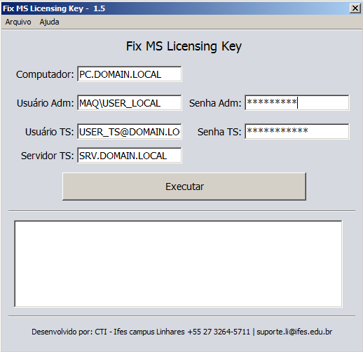

# FixMSLicensingKey
Pequeno aplicativo para atualizar a chave de registro de Licenças do servidor TS, através de computador remoto.

Versão 1.5 compilada e disponivel para [download](https://github.com/adrj/FixMSLicensingKey/blob/master/FixMSLicensingKey-%20v1.5.zip?raw=true)

##Modo de Uso
Execute a aplicação e informe todos os dados necessários para execução
O aplicativo foi construido considerando o sistema opecional Windows

###Funcionamento
O Aplicativo executa uma série de comandos pré compilados enviados aos computadores remotos através do PsExec.exe v 2.11.
Principais passos executados:

  * Descompactação e envio do aplicativo [rdp.exe](http://www.donkz.nl/) para o computador alvo;
  * Exclusão da chave de registro do MSLicensing;
  * Execução de conexão remota ao servidor especificado com as credenciais de administrador local, através do [rdp.exe](http://www.donkz.nl/);
  * Exclusão dos arquivos utilizados.
  

##Screen

## Licença

Este código é baseado na [Licença GPL v3](http://www.gnu.org/licenses/gpl-3.0.html), e os outros programas em suas respectivas licenças.

#### Foram tratadas somente algumas falhas, esteja avontade para melhorar o código.

### Softwares de terceiros utilizados

  * [PsExec v.211.](https://technet.microsoft.com/en-us/sysinternals/psexec.aspx);
  * [Rdp Remote Desktop Plus](http://www.donkz.nl/);
